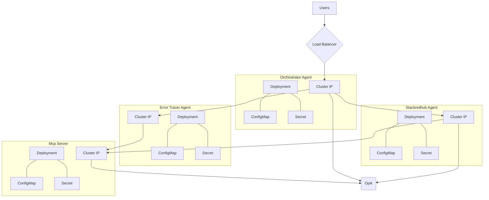

# CodeBuddy: Multi-Agent Orchestrator with Error Resolution

CodeBuddy is a multi-agent system designed to help developers troubleshoot and resolve errors faster. It leverages an **Orchestrator-Agent** architecture with specialized agents that can extract errors from logs/screenshots and resolve them using community-driven knowledge sources like GitHub, Reddit, and StackOverflow.  

It also integrates with a dedicated **MCP server** for tool access and **Opik** for observability, ensuring full visibility into agent behaviors.  

---

## 🚀 Features

- **Orchestrator Agent** – Routes tasks to the most suitable agent based on context and available tools.  
- **Error Extractor Agent** – Extracts and interprets error messages from logs or images.  
- **StackRedHub Agent** – Searches GitHub, Reddit, and StackOverflow for potential resolutions.  
- **MCP Server** – Provides a unified tool layer for agents to interact with.  
- **Agent Observability with Opik** – Monitor and analyze agent behavior in real time.  
- **CodeBuddy CLI** – Interactive developer companion to debug errors seamlessly.  

---

## 🏗️ Architecture

---
## ⚙️Getting Started
